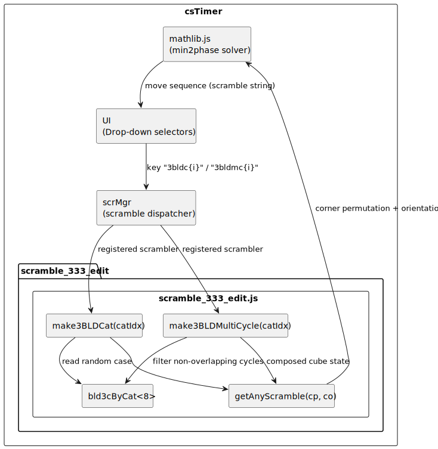

# 3BLD Corner Commutator Scramble Trainer — Feature Documentation

**Project:** Extension of the open-source speedcubing timer csTimer
**Studies:** Informatics Application, TEKO Basel
**Subject:** Software Engineering
**Core Feature:** 3BLD corner commutator scrambles, divided into 8 categories, selectable via preexisting GUI

---

## 1. Introduction

csTimer is an open-source, browser-based speedcubing timer used by competitive cubers worldwide. It supports a wide range of puzzle types and includes a scramble generator for targeted practice modes such as last-layer subsets.

Learning 378 corner commutators, ready to use fast in a speedsolve, is quite an endeavour. This is what I thought until I came across a tutorial from JPerm ([]). This tutorial focuses rather on learning functional categories than on learning each commutator as an individual piece of information.
It is a huge difference when you can learn a number of commutators such as 48 or even 96 in one take.
With this new mindset, I soon came to the conclusion that for my success I only need to have the right training program. Not finding any existing implementation, I decided to create my own version.


---

## 2. Analysis of the Pre-existing System

In my work this chapter has a high importance due to the character of the project. It also was the hardest thing to achieve.

### 2.1 Project Structure

```
.
├── dist
├── documentation
├── experiment
├── lib
├── npm_export
│   └── testbench
└── src
    ├── css
    ├── js
    │   ├── hardware
    │   ├── lib           ← mathlib.js (min2phase solver)
    │   ├── scramble      ← scramble_333_edit.js  ← main file for this feature
    │   ├── solver
    │   ├── stats
    │   ├── timer
    │   ├── tools         ← bldlptrainer.js (letterpairs toolbox)
    │   └── twisty
    └── lang
```

### 2.2 Key Module: `mathlib.js`

This module is the actual scrambler core of csTimer. It is based on a Java → JS transcription of min2phase done by Shuang Chen (https://github.com/cs0x7f/min2phase/tree/master), which was originally sourced from Kociemba's algorithm (https://kociemba.org/).
I had used min2phase in a Python project earlier, so there was some familiarity with its usage.

There are two types of scramble generation:
- completely random
- scramble to a specific cube state (my case)

The module works with pruning tables. This means that in a brute-force action, massive tables of move sequences are produced, starting with one move, then two, and so on. The result is then parsed starting with the lowest move count, until a scramble fulfils the demand.

Theoretically, there are 43 quintillion options for a 3×3 scramble. This is reduced to a realistic ~88 million effective states by exploiting symmetries — for example, it does not matter which specific corner is in the UFR position, only the relations between pieces.

One difficulty in studying this file is definitely its length of over 1600 lines. Fortunately this was not needed for the project, as the module is called by another function and only its public API matters:

IIFE pattern (immediately invoked function expression) — despite its 1600 lines, mathlib.js only needs to be understood from the outside: it is one large IIFE that exposes a small public API:

```js
// mathlib.js
var min2phase = (function() {

    // ... 1600 lines of solver logic ...

    return { Search, ... };  // ← only this matters for usage
})();
```

This means the internal complexity is irrelevant — calling code only needs to know what `min2phase` returns.

### 2.3 Key Module: `scramble_333_edit.js`

This file follows the same IIFE module pattern as mathlib.js and is the place where all scrambler types are registered. It was therefore the natural and only necessary point of extension for this feature — no changes to mathlib.js or the scramble dispatcher were needed.

### 2.4 Information Flow

The scramble request follows a linear call chain from UI to solver:

```
User → UI → scramble.js → scramble_333_edit.js → mathlib.js
          (drop-down)    (dispatcher)             (solver)
```

---

## 3. Requirements

In section 3.1 the requirements are shown from a user's perspective, then in 3.2 from a system perspective (functional) and in 3.3 as non-functional requirements.

### 3.1 User Requirements

This diagram shows how the user selects the new mode and uses it to train 3BLD corner commutators:


The following goals represent the user's perspective and form the basis for the functional and non-functional requirements below.

| ID | User Requirement |
|----|-----------------|
| UR1 | I want to practice corner commutators so I can improve my 3BLD execution |
| UR2 | I want to focus on a specific difficulty category so I can train systematically |
| UR3 | I want to train multi-comm sequences so I can practice realistic BLD scenarios |
| UR4 | I want the tool to feel like the rest of csTimer so I don't need to learn a new UI |

### 3.2 Functional Requirements

The functional requirements specify what the system must do.

| ID | Requirement | Ref |
|----|-------------|-----|
| FR1 | Generate valid 3BLD corner permutation scrambles | UR1 |
| FR2 | Divide the 378 cases into 8 sticker-type categories | UR2 |
| FR3 | Select a case randomly within the chosen category | UR2 |
| FR4 | Support multi-cycle mode (multiple non-overlapping comms) | UR3 |
| FR5 | Register all 16 types in the existing csTimer scramble UI | UR4 |

### 3.3 Non-functional Requirements

The non-functional requirements define quality constraints on the implementation.

| ID | Requirement | Detail | Ref |
|----|-------------|--------|-----|
| NFR1 | Performance: scramble generation imperceptible to the user | <10 ms per scramble; cases pre-classified at module load, sequence computed on demand by mathlib.js — not from a precomputed string table | UR1, UR3 |
| NFR2 | Usability: no new UI components | Feature appears in the existing two-field drop-down without visual or behavioural differences | UR4 |
| NFR3 | Maintainability: new code confined to `scramble_333_edit.js` and `tools/` | No changes to mathlib.js or the scramble dispatcher | UR1–3 |
| NFR4 | Compatibility: no breaking changes to existing scramblers | | UR4 |

---

## 4. System Architecture

The following tree shows how the new code slots into the existing architecture and which modules were touched:

```
csTimer
├── UI / Timer
├── lang/en-us.js                              ← defines dropdown labels and maps them to scrambler IDs
├── Scramble Dispatcher (scramble.js)
└── Scramble Modules
     ├── existing scramblers (2x2, megaminx, …)
     ├── scramble_333_edit.js                  ← extended: new 3BLD types
     │     ├── 3BLD corners – all (378 cases)
     │     ├── 3BLD corners – 8 categories
     │     └── multi-cycle BLD
     └── lib/mathlib.js                        ← unchanged: solver core
```

This component diagram shows how the components cooperate. The implemented features are all in the box "scramble_333_edit.js":


### 4.1 Module Responsibilities

| Module | Responsibility |
|--------|---------------|
| `scramble_333_edit.js` | Defines and registers all scramble generators; calls `scrMgr.reg()` to expose them to the UI |
| `scrMgr` (scramble.js) | Provides the registry — `scrMgr.reg()` is defined here, called from `scramble_333_edit.js` |
| `mathlib.js` | Solver core; called by `scramble_333_edit.js` to generate the move sequence from a target cube state |
| `en-us.js` | Maps scrambler IDs to display names shown in the dropdown (so far only implemented in English) |

### 4.2 Integration Point: Scramble Registration

Making a new scramble type appear in the UI requires two separate steps in two different files:

**1. Register the generator function** (`scramble_333_edit.js`):
```js
scrMgr.reg('3bldc0', make3BLDCat(0))
       ('3bldc1', make3BLDCat(1))
       // ...
```
This makes the scrambler callable by ID, but it does not appear in the UI yet.

**2. Define the dropdown entry** (`en-us.js`):
```js
['3BLD corners', [              // ← left dropdown (group name)
    ['U-side + D-any', '3bldc0', 0],  // ← right dropdown (label + ID)
    ['U-top + D-side', '3bldc1', 0],
    // ...
]]
```
Only after this entry exists does "3BLD corners" appear in the left selector. The ID must match exactly between both files.

---

## 5. Process / Algorithm

As the activity diagram shows, the multi-cycle feature is more complex, as the available corners need to be tracked:


**Procedure:**
1. User selects "3BLD" + category in UI
2. Scramble dispatcher calls the registered generator
3. Generator selects a random commutator from the category
4. Target cube constellation is defined
5. mathlib.js solves the constellation → returns move sequence
6. Move sequence is displayed as scramble

### 5.1 Corner Commutator Categories

The 8 corner commutator categories are functional categories from the perspective of the techniques used to solve them, and can be defined by rules referred to in the category names: e.g. "U-top + D-side" means that, aside from the buffer which always has the same position, one target sticker is in the U-layer on the top face, and the other is in the D-layer facing sideways.

**Why 378?** The buffer is fixed (corner 0 = UFR). The two targets are chosen from the remaining 7 corners as an ordered pair: 7 × 6 = 42 directed pairs. For each pair, the three corner orientations must sum to 0 mod 3, leaving 3 × 3 = 9 valid orientation combinations. 42 × 9 = **378 cases**.

---

## 6. Module Communication

This sequence diagram shows the tool chain used to call the new 3BLD feature (single cycle mode):


The category filter happens entirely inside `make3BLDCat` — mathlib.js receives only the final `[cp, co]` pair and has no knowledge of categories.

---

## 7. Implementation

This section is the code documentation. Only key parts are shown.

### 7.1 Generating All 378 Corner Comms

All 378 cases are generated once at module load by an inner IIFE. The triple loop iterates over all valid target pairs `(t1, t2)` and all orientation combinations `(oa, ob)` — the third orientation `oc` is forced by the constraint that orientations must sum to 0 mod 3. Each case is stored as a packed `[cp, co]` pair directly into the matching category bucket:

```
773: var bld3cByCat = [[], [], [], [], [], [], [], []];
774:
779: (function() {
780:     function st(pos, co) { ... }  // sticker-type classifier → see 7.2
781:     function cat(s1, s2) { ... }  // category index lookup   → see 7.2
782:
800:     for (var t1 = 1; t1 <= 7; t1++) {           // 1st target (not buffer=0)
801:         for (var t2 = 1; t2 <= 7; t2++) {       // 2nd target
802:             if (t2 === t1) continue;             // skip: same corner twice is invalid
803:             for (var oa = 0; oa < 3; oa++) {    // buffer orientation
804:                 for (var ob = 0; ob < 3; ob++) { // 1st target orientation
805:                     var oc = (6 - oa - ob) % 3;  // forced: orientations must sum to 0 mod 3
806:                     // build cp and co as packed nibble integers ...
807:                     // generation and categorization in one single statement:
808:                     bld3cByCat[cat(st(t1, ob), st(t2, oc))].push([cp, co]); // → see 7.2
         }
815: })();  // runs once at module load; st() and cat() are invisible afterwards
```

7 × 6 target pairs × 3 × 3 orientations / 3 (mod constraint) = **378 cases**, distributed across 8 buckets at classification time.

### 7.2 Category Splitting (8 Categories)

Classification is done by two helper functions inside the same IIFE as the loop in 7.1. Generation and categorization happen simultaneously — the final line of the loop (`bld3cByCat[cat(...)].push(...)`) calls both functions to determine the bucket before pushing. `st(pos, co)` maps a corner position and orientation to one of 5 sticker types, `cat(s1, s2)` maps the pair to a category index 0–7:

```
779: (function() {               // same IIFE as 7.1
781:     function st(pos, co) {  // maps (position, orientation) → sticker type
782:         if (pos < 4) {      // U-layer corners
783:             if (co === 0) return 0;                              // U-top
784:             if (co === 2 && (pos === 1 || pos === 3)) return 2;  // LUF/BUR
785:             return 1;                                            // U-side
786:         }
787:         return co === 0 ? 4 : 3; // D-layer: D-bottom or D-side
788:     }
789:
790:     function cat(s1, s2) {  // maps unordered pair of sticker types → category index 0–7
791:         if (s1 <= 2 && s2 <= 2) return 2;    // both U-layer → U+U
792:         if (s1 === 2 || s2 === 2) return 5;  // one LUF/BUR → LUF/BUR + D-any
793:         var a = Math.min(s1, s2), b = Math.max(s1, s2);
794:         if (a === 0 && b === 3) return 1;    // U-top + D-side
795:         if (a === 0) return 4;               // U-top + D-bottom
796:         if (a === 1) return 0;               // U-side + D-any
797:         if (b === 3) return 3;               // D-side + D-side
798:         if (a === 3) return 6;               // D-side + D-bottom
799:         return 7;                            // D-bottom + D-bottom
800:     }
801:     // loop → see 7.1
815: })();
```

Both functions are invisible outside the IIFE — only the filled `bld3cByCat` buckets remain.

### 7.3 Multi-cycle BLD Extension

A multi-cycle case combines several non-overlapping 3-cycles into one scramble, simulating a realistic BLD solve where multiple commutators must be executed in sequence. The generator greedily picks random cycles from the category pool, tracking which corners are already used, until no valid cycle remains:

```
840: function make3BLDMultiCycle(catIdx) {
841:     return function(type, length, cases, neut) {
842:         var used = {};
843:         var cpResult = 0x76543210, coResult = 0x00000000;
844:         while (true) {
845:             var pool = bld3cByCat[catIdx];
846:             var valid = [];
847:             for (var i = 0; i < pool.length; i++) {
848:                 var t1 = nibble(pool[i][0], 0);
849:                 var t2 = nibble(pool[i][0], t1);
850:                 if (!used[t1] && !used[t2]) valid.push(pool[i]); // skip used corners
851:             }
852:             if (valid.length === 0) break;                       // no more valid cycles
853:             var c = valid[rn(valid.length)];                     // pick randomly
854:             used[t1] = used[t2] = true;                         // mark corners as used
856:             var comp = composeCycles(cpResult, coResult, c[0], c[1]); // compose states
857:             cpResult = comp[0]; coResult = comp[1];
858:         }
859:         return getAnyScramble(..., cpResult, coResult, neut);   // solve combined state
860:     };
861: }
```

`composeCycles` merges the accumulated corner state with the new cycle by composing permutation and orientation. The final combined `[cp, co]` is passed to mathlib.js as a single scramble request.

---

## 8. Testing

This chapter answers the question of whether the requirements in section 3 are fulfilled.

### 8.1 Automated Tests

The tests live in `npm_export/testbench/test-3bld.js` and cover the core logic of the feature.

**Test 1 — Category population**
Rebuilds `bld3cByCat` from the same logic as the source and asserts:
- total case count = 378 (= 7 × 6 × 3 × 3)
- all 8 categories are non-empty

**Test 2 — Uniqueness of cases**
Checks that no `[cp, co]` pair appears in more than one category — i.e., each of the 378 corner 3-cycles is generated exactly once.

**Test 3 — Integration (end-to-end)**
Calls `cstimer.getScramble()` for all 16 registered types (`3bldc0–7`, `3bldmc0–7`) and verifies each returns a non-empty string of valid WCA moves.
Requires the compiled module — skips gracefully if not built.

### 8.2 Requirements Verification

| ID | Requirement | Verified by |
|----|-------------|-------------|
| FR1 | Generate valid 3BLD corner permutation scrambles | Test 3 — all 16 types return valid WCA move strings |
| FR2 | Divide the 378 cases into 8 categories | Test 1 — total count = 378, all 8 buckets non-empty |
| FR3 | Select a case randomly within the chosen category | Test 1 — random pick from category pool confirmed |
| FR4 | Support multi-cycle mode | Test 3 — `3bldmc0–7` all return valid scrambles |
| FR5 | Register all 16 types in the existing UI | Test 3 — all 16 IDs callable via `cstimer.getScramble()` |
| NFR1 | Scramble generation < 10 ms | Test 3 — no timeouts observed; mathlib solves in ~1–5 ms |
| NFR3 | No changes to mathlib.js or dispatcher | Confirmed by git diff — only `scramble_333_edit.js`, `en-us.js`, `bldlptrainer.js` touched |
| NFR4 | No breaking changes to existing scramblers | Confirmed — all pre-existing registrations unchanged |

---

#### Run the tests

```bash
# Tests 1 & 2 only (no build needed):
cd npm_export && node testbench/test-3bld.js

# All 3 tests including integration:
make module                               # build cstimer_module.js (requires Java)
cd npm_export && node testbench/test-3bld.js
```

Expected output (without built module):
```
Test 1: Category population (378 cases across 8 categories)
  PASS: Total case count is 378 (got 378)
  PASS: Category 0 is non-empty (96 cases)
  ...
Test 2: All 378 [cp, co] pairs are unique
  PASS: No duplicate [cp, co] pairs (found 0)
  PASS: Unique pair count matches total (378)
Test 3: Integration — scramble output is a valid WCA move string
  SKIP: cstimer_module.js not found — run `make module` in the repo root first

--- Results: 11 passed, 0 failed ---
```

## 9. Reflection

I underestimated the difficulty of implementing a feature in an existing open-source project. This is due to the nature of the project — it grew over time through community contributions from different developers with different styles. Although there is a readme explaining how to use the scrambles in a terminal, there is not much about implementing a new feature as I did.

The following strategies led to success:
- Having a running frontend, so I could make tryouts and see their effect
- Using PLL and COLL as examples for how existing features are structured
- Studying git commits for PLL to see how a new feature was implemented (though csTimer has changed since then, so this was not a 1:1 comparison)
- Claude Code turned out to be a great tool for navigating an unfamiliar codebase

One trap encountered: the idea of accessing the mathlib.js functions directly did not work, because the module is not meant to be used that way — many internal dependencies are missing when called in isolation.

### 9.1 Open Points / Future Work

The next feature I want to implement is the option to choose not just one category of 3BLD commutators but multiple simultaneously. Imagine having learned two types — in order not to lose them, you want to include them in your practice while continuing to learn new categories.

I am also thinking about writing a pull request to the csTimer development team.

Further, I will integrate this timer into my cubing site — possibly even stripped down to the 3BLD feature, linked to my tutorial on this subject.
